# Drift & Convergence: blog design directions

This document lays out three design directions for the blog on this site (the writing section
under `/writing/`), so that one can be chosen. The prototypes were built as pages on the
preview deployment of this pull request, at `/design/blog/`. They are removed after review, so
the pictures below show every direction as it looked in the prototypes, and the descriptions
and pictures alone should be enough to compare them. The prototypes use invented sample posts
and four sample topics; they are not the published blog.

## How to compare

Preview index: `https://70e5332d-dcc-web.drc-dev.workers.dev/design/blog/`. That address is
the Cloudflare commit preview for the commit that carried the prototypes (`9e83e04`), so it
stays live after the prototype pages are removed from the branch, until Cloudflare retires the
version. On a local build the same pages are at `/design/blog/`, and the directions are at
`/design/blog/a/`, `/design/blog/b/` and `/design/blog/c/`.

Each direction has the same three screens, shown in the pictures: the landing page (the front
of the writing section), the listing (all posts, newest first, split into pages), and one
post (the full sample post with a feature image, a table, a code sample and headings). Each
direction also has a page per topic, linked from the preview but not pictured.

| Axis | Direction A: Front page | Direction B: Timeline | Direction C: Topic hubs |
| --- | --- | --- | --- |
| The idea | A magazine front page: a lead story, then featured posts, then recent posts | A reading log: one newest-first stream | A field guide organised by the four topics |
| Grouping of posts | By recency; featured posts are pulled out into their own grid | By date, under month headings on the landing page and year headings in the listing | By topic: one hub per topic |
| Landing order | Lead story (the newest post), topic pill row, featured grid, latest cards | Short "Start here" list, then the stream grouped by month, then a topic filter row | A strip of the three newest posts, then one hub per topic |
| Featured posts | A bento grid of larger cards under the lead story, marked "Featured" | A numbered "Start here" list pinned above the stream, marked "Featured" in the stream | The featured post leads its topic hub |
| Page layout | Card grids with large feature images | One narrow text column on a vertical timeline, mostly text, no images | Text rows in a two-column grid of hubs; a side index of topics on the listing; contents list beside a post |
| Topic presentation | Colour-coded pills on every card | Plain text links in a filter row | Topics are the main structure of the section |
| Post address | `/writing/{slug}/` | `/writing/{slug}/` | `/writing/{year}/{slug}/` |

## Direction A: Front page

### Summary

A magazine front page. The newest post is a large lead story, the featured posts sit in a
bento grid beneath it, and a card grid of recent posts follows. Topics are colour-coded pills
on every card.

### Preview

Preview links, once the pull request exists (replace the placeholder with the preview URL):

- Landing: `https://70e5332d-dcc-web.drc-dev.workers.dev/design/blog/a/`
- Listing: `https://70e5332d-dcc-web.drc-dev.workers.dev/design/blog/a/all/`
- Topic: `https://70e5332d-dcc-web.drc-dev.workers.dev/design/blog/a/topics/compliant-data/`
- Post: `https://70e5332d-dcc-web.drc-dev.workers.dev/design/blog/a/ai-agents-and-the-mainframe/`

### Pictures

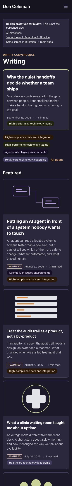
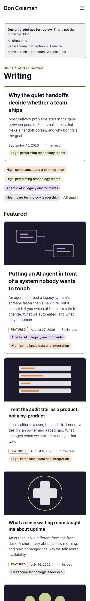
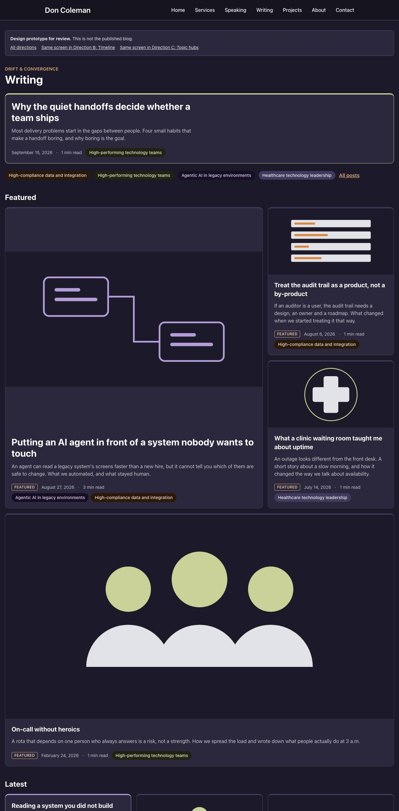
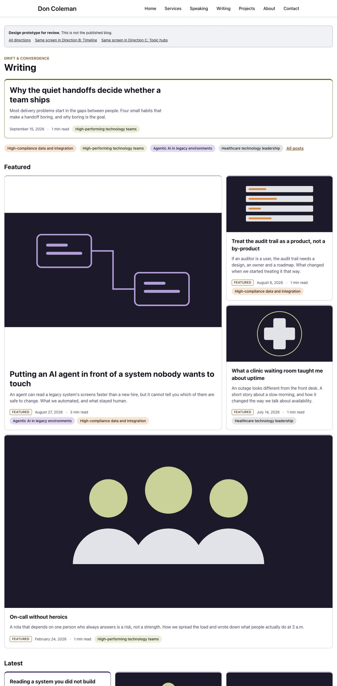
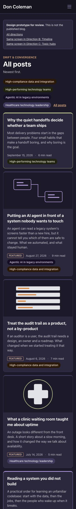
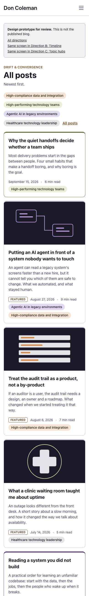
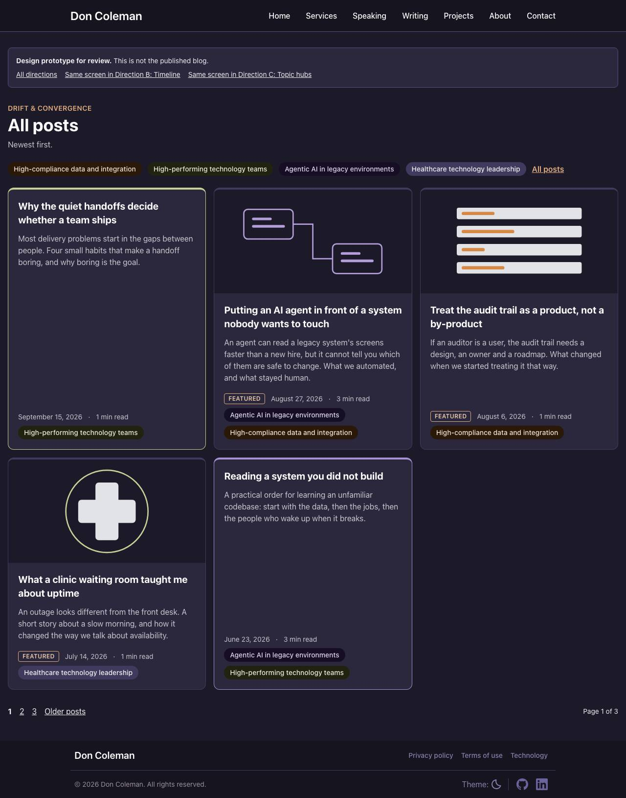
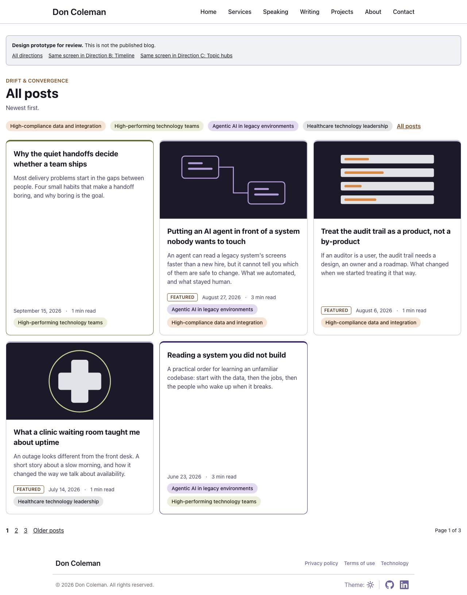
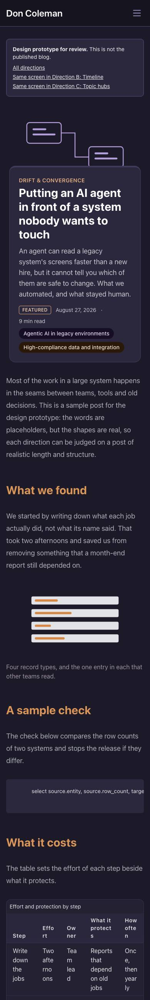
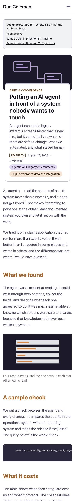
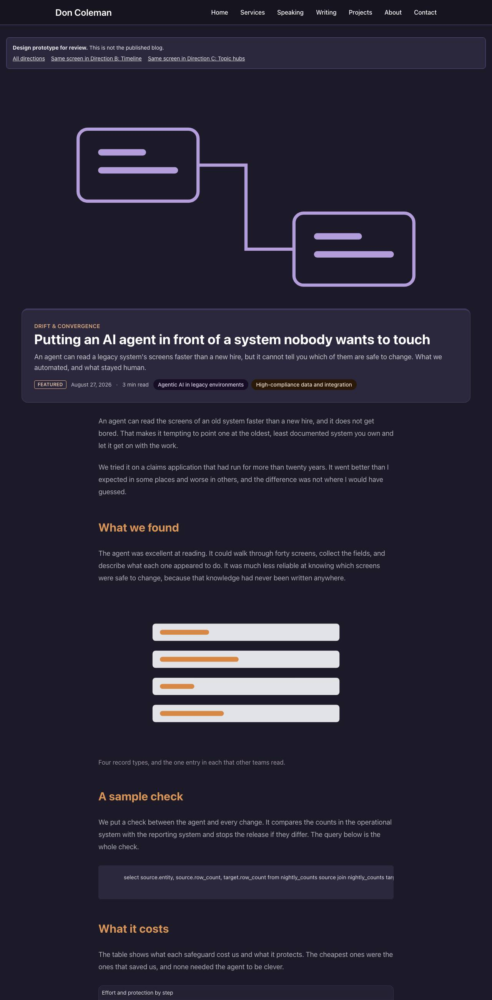
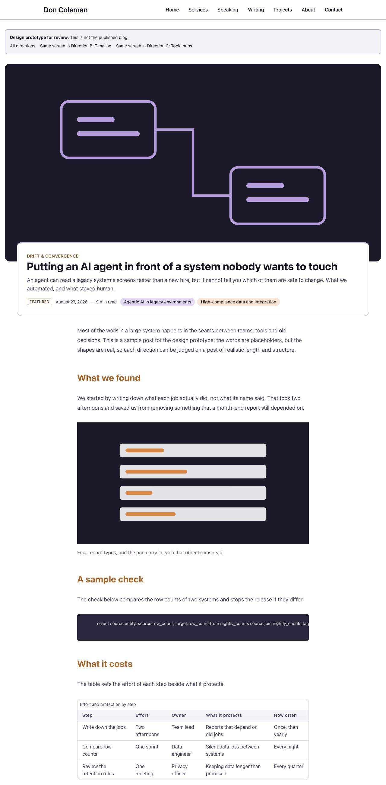

### How topics are presented

Colour-coded pills on every card and a pill row under the landing heading. A topic page opens
with an introduction banner in the topic's colour, followed by a card grid.

### Proposed addresses

| Page | Address |
| --- | --- |
| Landing | `/writing/` |
| All posts | `/writing/all/` |
| Page N of all posts | `/writing/all/{n}/` |
| Topic | `/writing/topics/{topic}/` |
| Post | `/writing/{slug}/` |

No post address contains a topic, so renaming, merging or splitting topics changes no post
address. Only the topic pages' own addresses change.

### When no post is featured

The bento grid is omitted and the lead story is the newest post.

### New colours or fonts

None.

### Trade-offs

- Reading experience: the most visual of the three; feature images and the lead story make
  the front page inviting, but a reader who wants a plain list has to go to the listing.
- Growth in the number of posts: the landing page shows a fixed set (lead, featured, latest),
  so it stays the same size as posts grow; older posts are reached through the paged listing
  and topic pages.
- Build effort: medium. A card component, a bento layout and topic banners; more images to
  prepare than Direction B.
- Cost of renaming, merging or splitting topics: low for posts, since post addresses hold no
  topic. Topic pills and banners are driven by the topic list, and the colour of each topic
  must be kept distinct if topics are added.
- Dependence on feature images: high. The cards and the bento grid are designed around an
  image; posts without one need a fallback that still looks deliberate.
- Phone behaviour: the grids collapse to a single column of cards, which works, but the page
  is long because every card carries an image.

## Direction B: Timeline

### Summary

A reading log. One newest-first stream on a vertical timeline, grouped by month and mostly
text. A short "Start here" list pinned above the stream carries the featured posts.

### Preview

Preview links, once the pull request exists (replace the placeholder with the preview URL):

- Landing: `https://70e5332d-dcc-web.drc-dev.workers.dev/design/blog/b/`
- Listing: `https://70e5332d-dcc-web.drc-dev.workers.dev/design/blog/b/all/`
- Topic: `https://70e5332d-dcc-web.drc-dev.workers.dev/design/blog/b/topics/compliant-data/`
- Post: `https://70e5332d-dcc-web.drc-dev.workers.dev/design/blog/b/ai-agents-and-the-mainframe/`

### Pictures

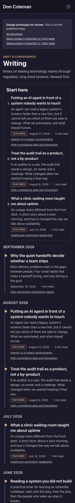
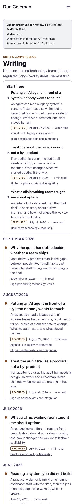
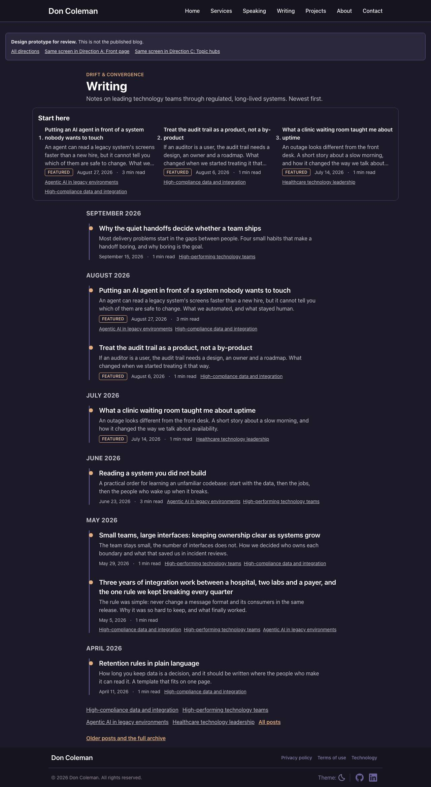
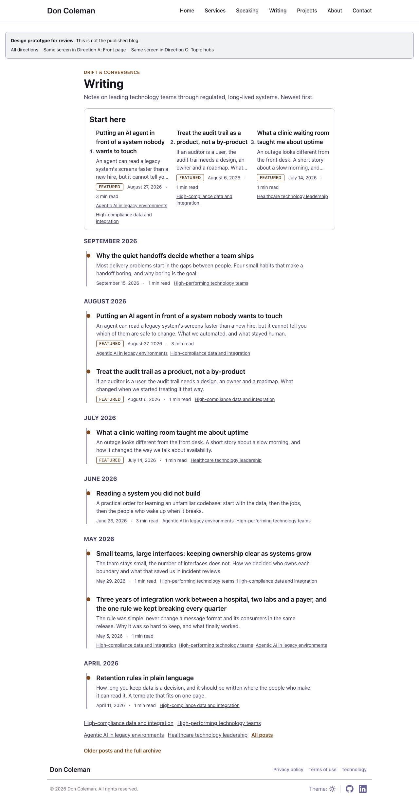
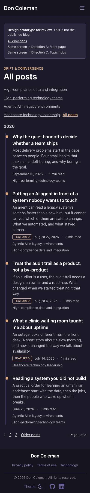
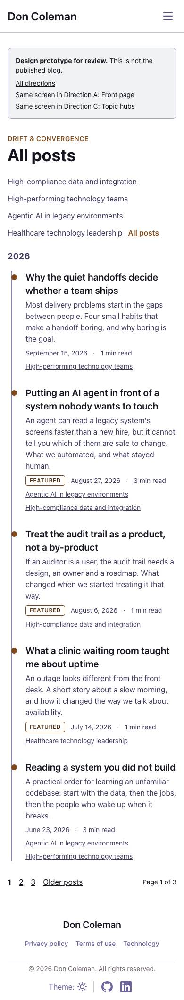
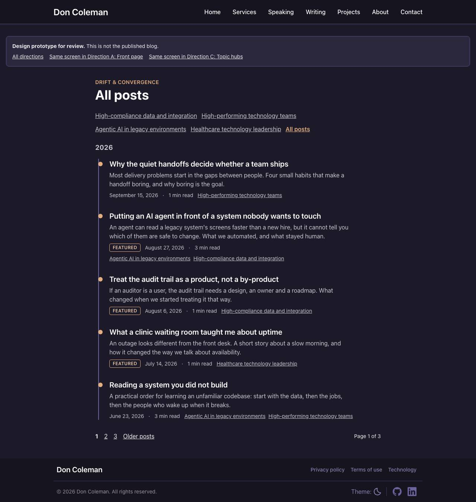
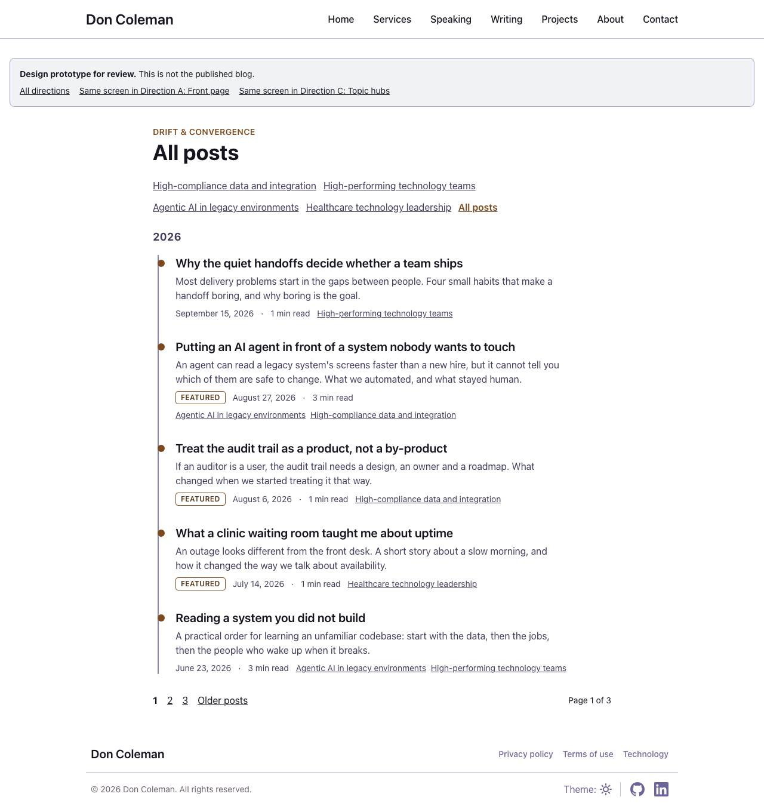
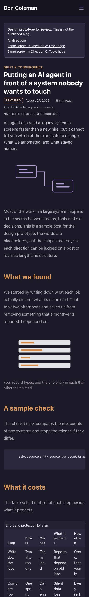
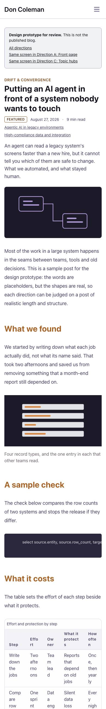
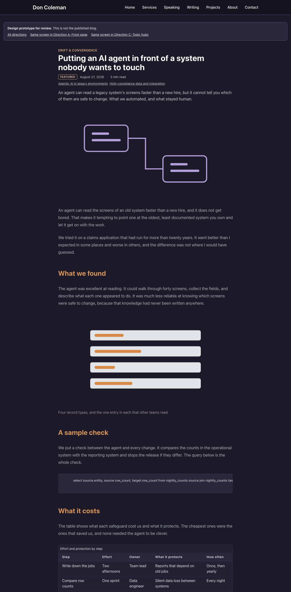
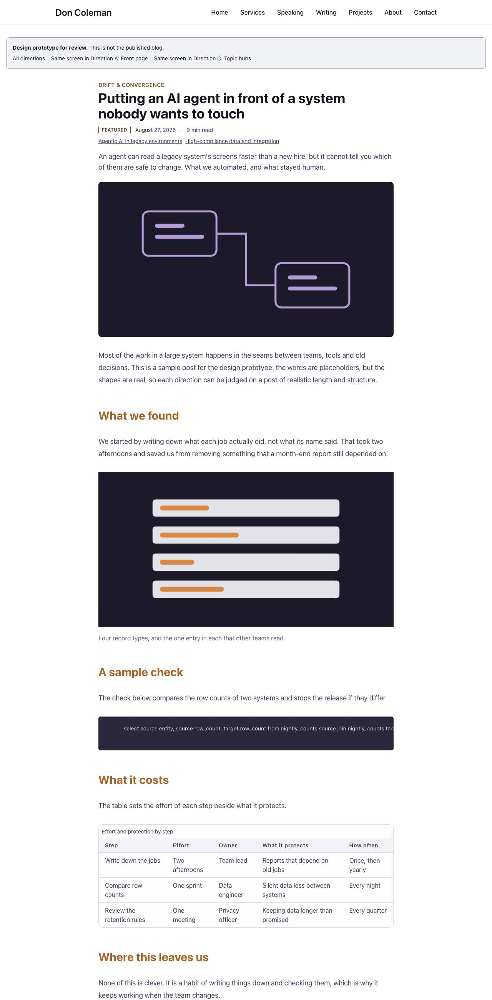

### How topics are presented

Plain text topic links in a filter row above the stream. A topic page is an introduction
paragraph followed by the same timeline, filtered to that topic.

### Proposed addresses

| Page | Address |
| --- | --- |
| Landing | `/writing/` |
| All posts | `/writing/all/` |
| Page N of all posts | `/writing/all/{n}/` |
| Topic | `/writing/topics/{topic}/` |
| Post | `/writing/{slug}/` |

No post address contains a topic, so renaming, merging or splitting topics changes no post
address. Only the topic pages' own addresses change.

### When no post is featured

The "Start here" list is omitted and the stream begins with the newest post.

### New colours or fonts

None.

### Trade-offs

- Reading experience: calm and easy to scan for someone who reads the blog regularly; the
  summary and date of each post are always visible. It is the least striking for a first-time
  visitor.
- Growth in the number of posts: the stream is built to grow, since month and year headings
  keep a long list readable, and the listing is paged. The landing page shows only the newest
  posts, so old posts drop out of sight unless they are featured or reached by topic.
- Build effort: lowest of the three. Mostly text, one timeline component and a filter row.
- Cost of renaming, merging or splitting topics: low. Topics are plain text links and
  introductions, and post addresses hold no topic.
- Dependence on feature images: none on the landing page and listing, which use no images.
  A feature image appears only at the top of a post, so posts without one lose little.
- Phone behaviour: the best of the three. A single narrow column is the same layout at every
  width, so the phone view is simply the desktop view without side space.

## Direction C: Topic hubs

### Summary

A field guide. The writing is organised around the four topics. Each topic is a hub with its
introduction, its featured post and its newest posts, with a strip of the three newest posts
above them.

### Preview

Preview links, once the pull request exists (replace the placeholder with the preview URL):

- Landing: `https://70e5332d-dcc-web.drc-dev.workers.dev/design/blog/c/`
- Listing: `https://70e5332d-dcc-web.drc-dev.workers.dev/design/blog/c/all/`
- Topic: `https://70e5332d-dcc-web.drc-dev.workers.dev/design/blog/c/compliant-data/`
- Post: `https://70e5332d-dcc-web.drc-dev.workers.dev/design/blog/c/2026/ai-agents-and-the-mainframe/`

### Pictures

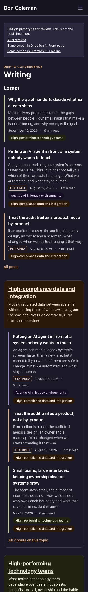
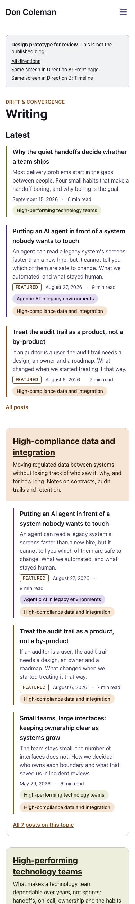
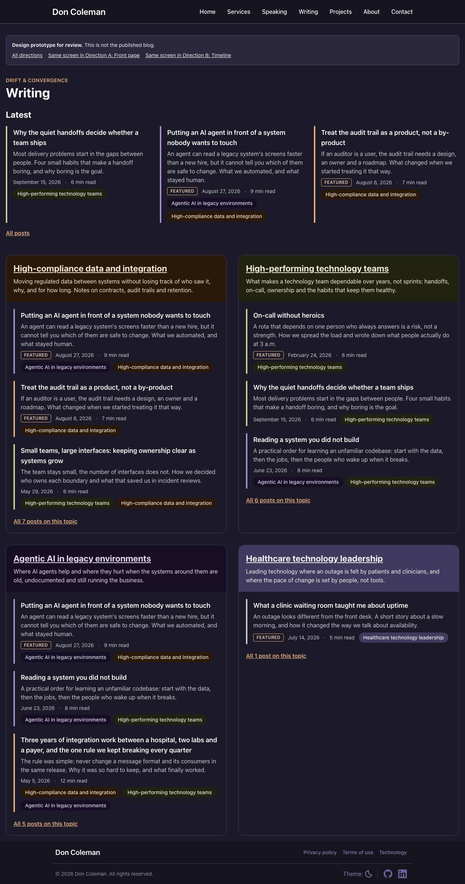
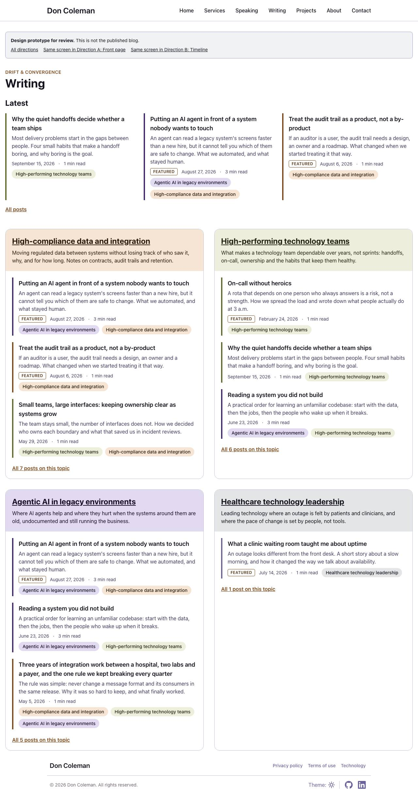
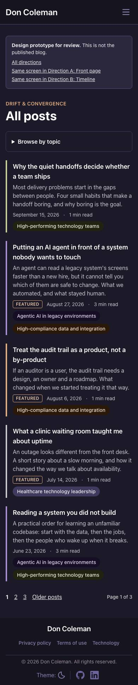
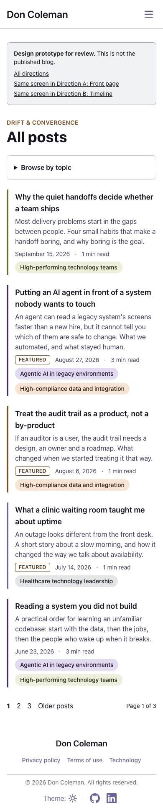
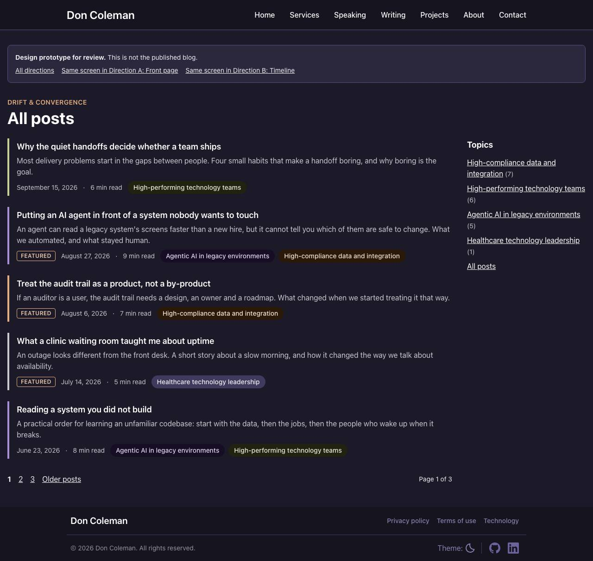
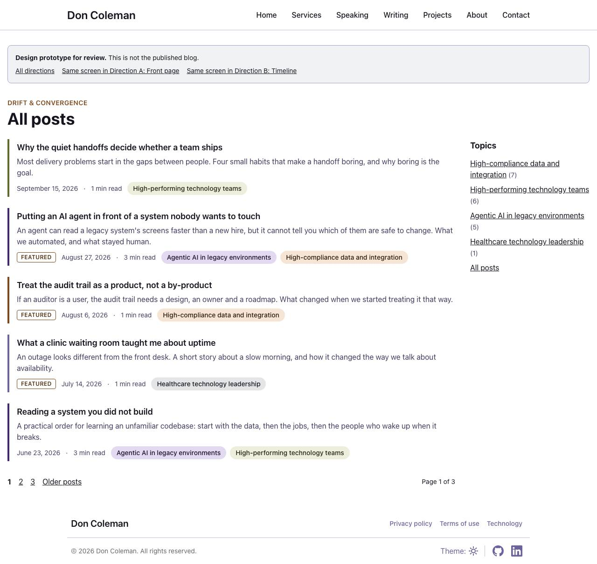
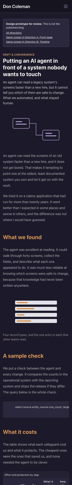
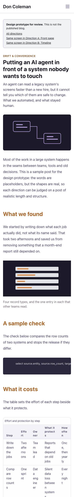
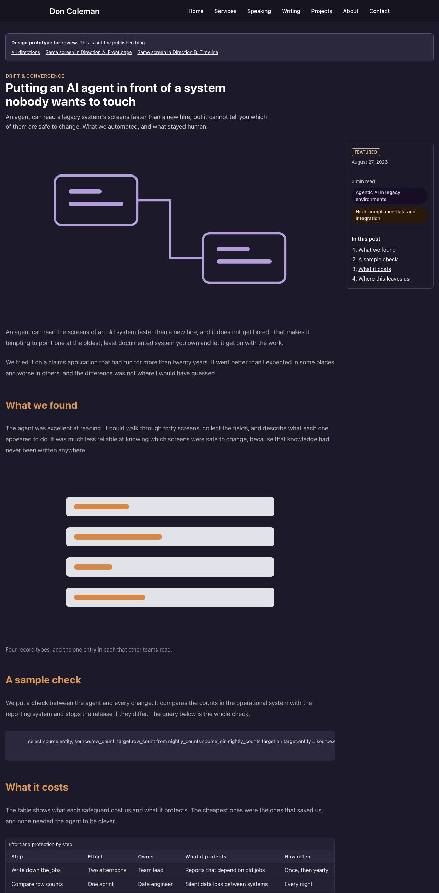
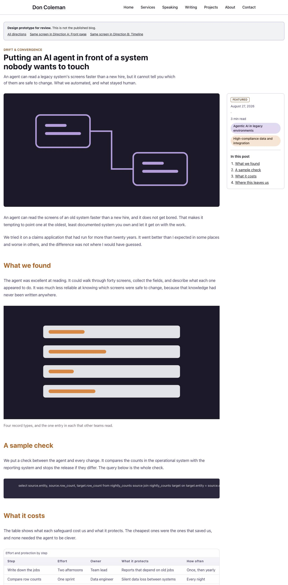

### How topics are presented

Topics are the main structure. The listing has a side index of topics (a disclosure on
phones), and each topic hub shows its introduction, featured post and every post in it.

### Proposed addresses

| Page | Address |
| --- | --- |
| Landing | `/writing/` |
| All posts | `/writing/all/` |
| Page N of all posts | `/writing/all/{n}/` |
| Topic | `/writing/{topic}/` |
| Post | `/writing/{year}/{slug}/` |

No post address contains a topic (the year is the publication year), so renaming, merging or
splitting topics changes no post address. Only the topic pages' own addresses change. Because
topic addresses sit directly under `/writing/`, a topic slug must never equal `all` or a year.

### When no post is featured

Each topic hub leads with its newest post instead of a featured one.

### New colours or fonts

None.

### Trade-offs

- Reading experience: best for a visitor who arrives with a subject in mind, since the
  landing page answers "what does he write about". A visitor who wants only the latest post
  finds it in the top strip.
- Growth in the number of posts: each hub shows a fixed number of posts, so the landing page
  stays the same size; a topic with many posts needs its own paging. Works best while the
  number of topics stays small.
- Build effort: highest. Hubs, a topic side index, a contents list on posts and a topic
  address scheme that must avoid clashes with `all` and years.
- Cost of renaming, merging or splitting topics: highest of the three in effect, since the
  landing page is built from the topic list and a change reshapes the front page. Post
  addresses are unaffected; topic page addresses change and would need redirects.
- Dependence on feature images: low. Rows are text only, and the hub banners use
  topic colour rather than pictures.
- Phone behaviour: hubs stack into one column and the topic index becomes a disclosure. The
  landing page is long on a phone because it holds four hubs.

## Notes common to all directions

- Syntax highlighting is deferred to the blog build, because Astro's built-in highlighter is
  incompatible with the site's content security policy; the prototype shows code as plain
  text.
- Addresses from the current site are not redirected.
- Feeds and search are out of scope.
- The prototypes use invented sample posts, images drawn as simple graphics, and only colours
  and fonts already on the site.

## Decision

Chosen direction:

Notes:
