# Portfolio design directions

These are three ways to present a project on the portfolio: a story page that walks through one project, and an index page that lists them all. Each direction has both pages. This document compares them so Don can choose one; it does not choose for him.

The sample project is Focus Pocus. Its story is draft content written for Don's review, and every stage is marked as a draft in the pages. The screenshots and demo clips inside the stories are labelled placeholders, not real captures. Focus Pocus has no live demo, so its page on drc.dev stands in as the demo link. The other three index entries (Tempo, Flux and drc.dev) are sample entries with no story page.

The screenshots in this document are full-page captures of each page at 390 px (phone) and 1280 px (desktop) in light and dark themes, taken with reduced motion requested so every stage is in its final state. There are 24 of them: three directions, two pages, two widths and two themes.

## Preview addresses

Every address below is pinned to commit `1f35eae43904d7134c2b7e5eb573565b7ffc0cee`, the last commit that still contained the prototypes, so the links keep working after the prototypes are removed from the site. Cloudflare keeps a limited number of versions, so these links may expire; the screenshots are the lasting record.

- Hub (all three directions): https://81aad47f-dcc-web.drc-dev.workers.dev/design/portfolio/

## Direction A: Timeline

Stages sit on a vertical rail, one after another. Each option is a native disclosure that opens in place, and each stage fades and rises into view as it scrolls in. The index is a chronological list with the same filter as the other directions.

### Preview

- Index: https://81aad47f-dcc-web.drc-dev.workers.dev/design/portfolio/a/
- Story (Focus Pocus): https://81aad47f-dcc-web.drc-dev.workers.dev/design/portfolio/a/focus-pocus/

### Screenshots

| Page | Phone, light | Phone, dark | Desktop, light | Desktop, dark |
| --- | --- | --- | --- | --- |
| Story | 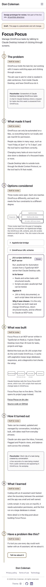 | 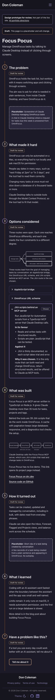 | 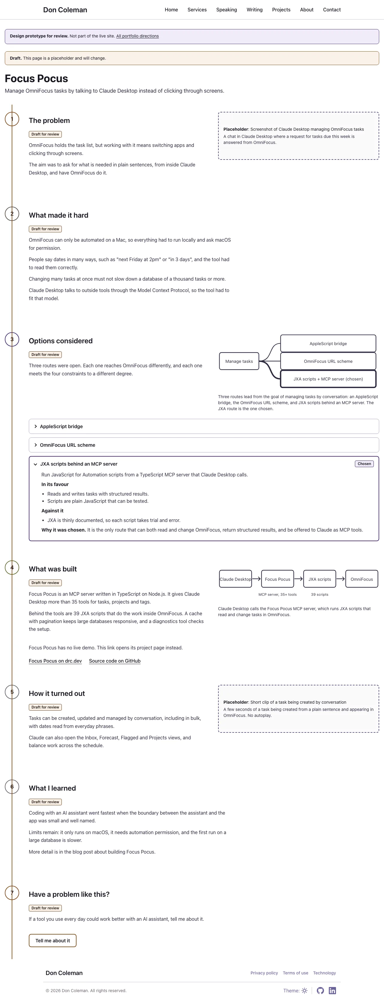 | 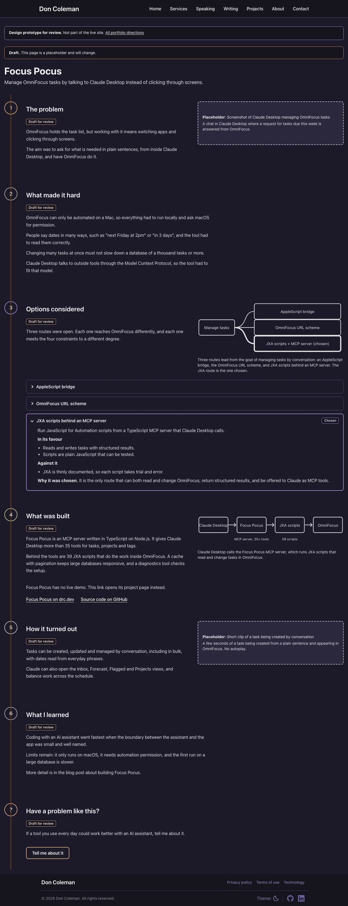 |
| Index | 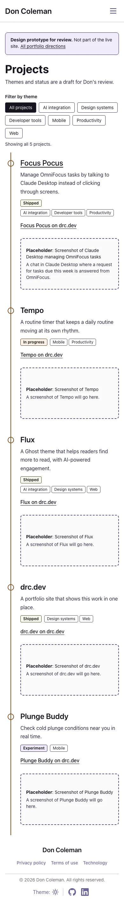 | 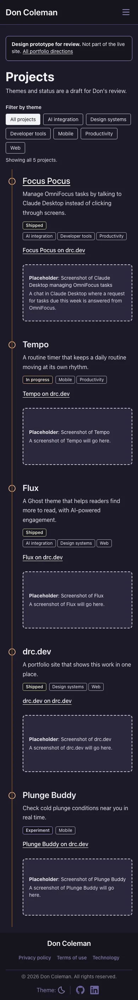 | 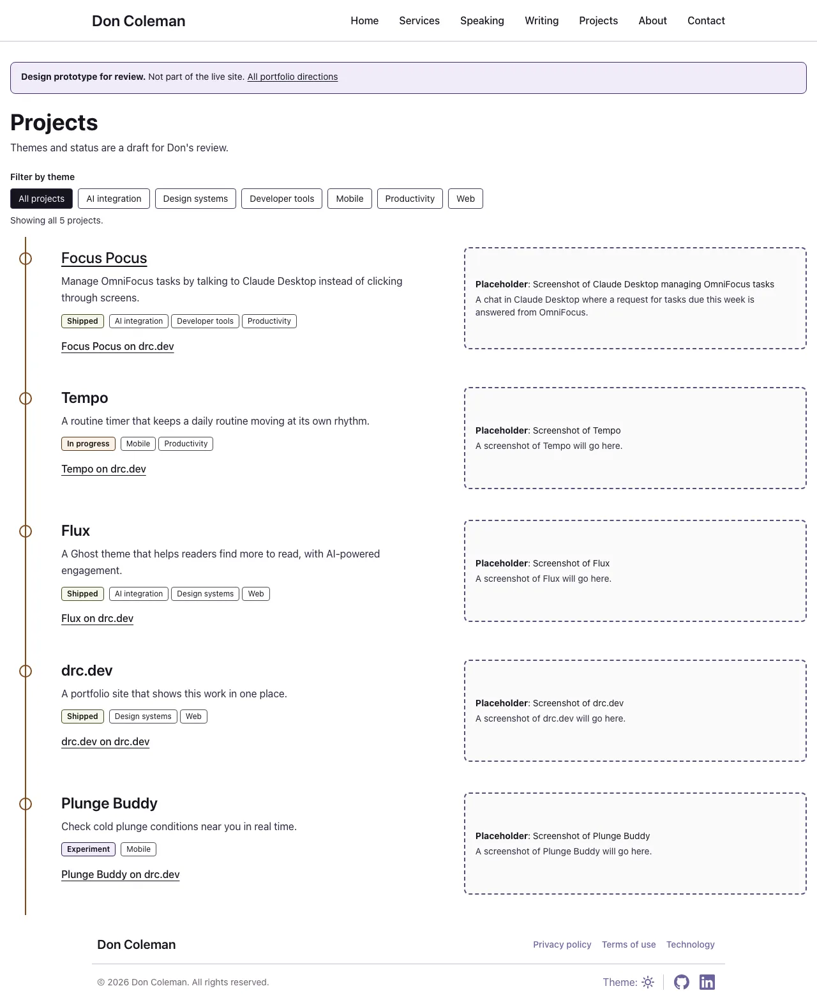 | 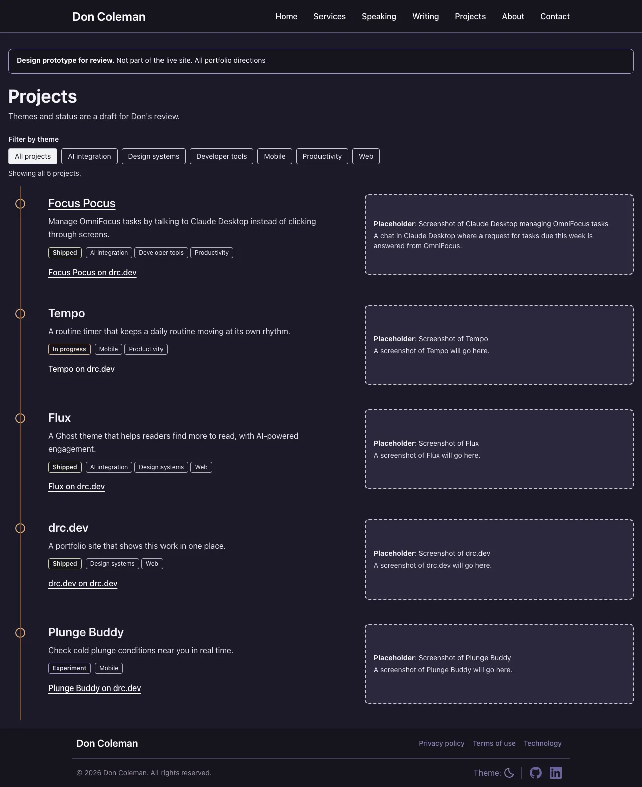 |

### How it works

**Story stages.** Seven stages on a vertical rail, in the fixed order: the problem, what made it hard, options considered, what was built, how it turned out, what I learned, and a contact hand-off. With reduced motion requested the stages are simply there, with no movement. With JavaScript off nothing changes, because the story page needs no script.

**Option comparison.** Each option is a native `details` element that opens in place. The chosen option starts open and carries a "Chosen" label plus the reason, so the choice is visible without interaction. With reduced motion requested it opens without animation. With JavaScript off it works as normal, because `details` is built into the browser.

**Demo embeds.** Linked, not embedded. The built stage holds a labelled placeholder for a screenshot or clip and a link to the Focus Pocus page on drc.dev, which stands in because there is no live demo. Nothing autoplays, so reduced motion changes nothing here, and with JavaScript off the link works as usual.

**Scroll reveals.** Each stage fades and rises as it enters the viewport, driven by CSS scroll-driven animation where the browser supports it. With reduced motion requested the reveal is switched off and every stage shows in its final state. With JavaScript off the reveal still works, because it is CSS only. There is no page transition between the index and the story.

### Trade-offs

**Does well.** It is the smallest of the three. Native `details` gives keyboard and screen reader behaviour for free, and the story page needs no script. The single column reads the same on a phone and a desktop, and it stays close to the site's existing look. It is the easiest of the three to extend with more stages.

**Does poorly.** Options are the least visible: a reader sees the names, then has to open each one to compare. There is no side-by-side view of options against constraints. There is no page transition, so moving from the index to the story feels like an ordinary page load. The rail is decorative and does not show how far through the story you are.

**Build and maintenance effort.** Low. One stylesheet of layout and one small filter script shared with the index. There are no custom interactive widgets to keep working across browsers.

**Risks.** Accessibility: low, since it relies on native elements; the main check is that the reveal never hides content. Browser support: without scroll-driven animations the stages show without the fade, which is a graceful fallback. Real media: a single column takes screenshots and clips easily, but very tall clips lengthen the page. Scaling: the chronological index list stays simple as projects are added, but has no grouping.

### New visual resources

None.

## Direction B: Cards

Stages are stacked cards. Options are WAI-ARIA tabs, one tab per option. The index is a six-column bento grid of cards with one large card first. Pages change with a cross-document view transition.

### Preview

- Index: https://81aad47f-dcc-web.drc-dev.workers.dev/design/portfolio/b/
- Story (Focus Pocus): https://81aad47f-dcc-web.drc-dev.workers.dev/design/portfolio/b/focus-pocus/

### Screenshots

| Page | Phone, light | Phone, dark | Desktop, light | Desktop, dark |
| --- | --- | --- | --- | --- |
| Story | 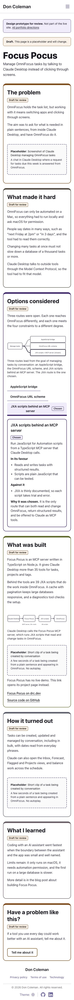 | 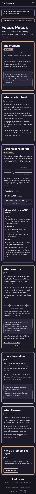 | 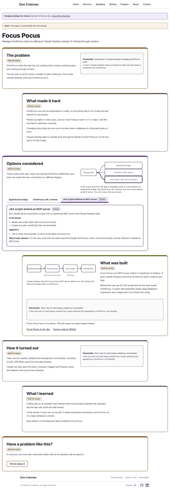 | 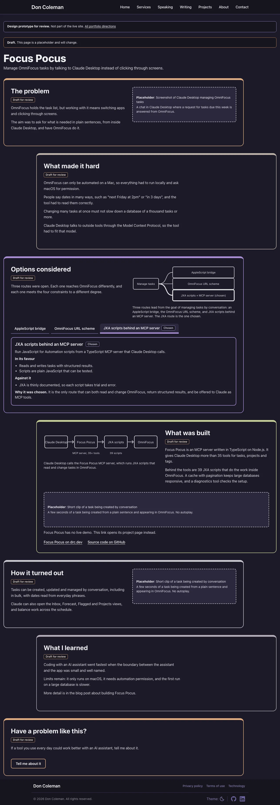 |
| Index | 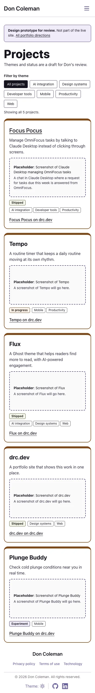 | 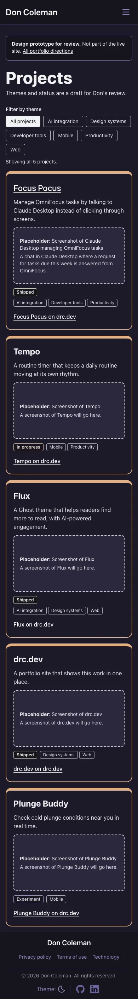 | 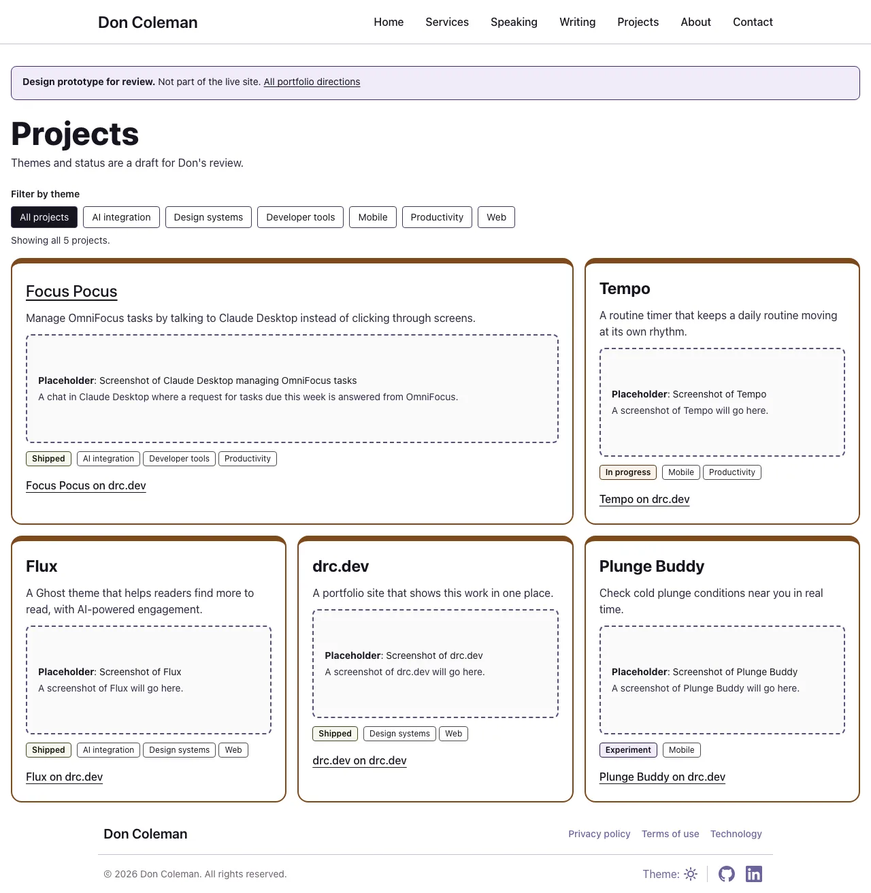 | 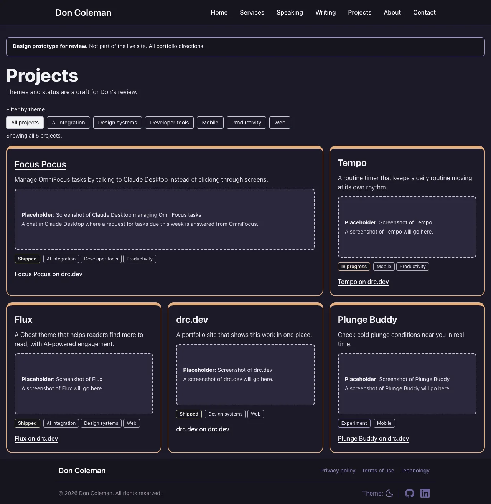 |

### How it works

**Story stages.** Seven stacked cards in the fixed order, each a self-contained block with its own heading and no sticky parts. With reduced motion requested the cards show in their final state with no movement. With JavaScript off all seven cards still show and read in order.

**Option comparison.** One tab per option in a tab list, following the WAI-ARIA tabs pattern with automatic activation and arrow-key navigation. The chosen option is selected first and labelled "Chosen" with the reason. Reduced motion does not change the tabs, which switch instantly. With JavaScript off the tab list is hidden and every option panel shows one after another, so nothing is lost.

**Demo embeds.** Linked, not embedded. A demo panel holds a labelled still-frame placeholder, the stand-in note, and links to the Focus Pocus page on drc.dev (the stand-in for a live demo) and the source on GitHub. Nothing autoplays, so reduced motion changes nothing here, and the links work with JavaScript off.

**Scroll reveals.** Cards rise in one after another as they scroll into view, using CSS scroll-driven animation where supported. Moving between the index and the story uses a cross-document view transition that carries the Focus Pocus title across. With reduced motion requested both the reveal and the transition are off. With JavaScript off both still work, because they are CSS only.

### Trade-offs

**Does well.** The card structure makes each stage easy to scan and gives the index a clear visual hierarchy: the bento grid gives Focus Pocus the largest card. Tabs show all option names at once, and the chosen one is marked. The view transition makes index-to-story feel connected.

**Does poorly.** Tabs show one option at a time, so comparing two options means switching back and forth. The six-column grid needs care at in-between widths. It ships more script than Direction A: a tabs component as well as the filter. The view transition and tabs are more to test than native elements.

**Build and maintenance effort.** Medium. The tabs component is custom code that has to keep the WAI-ARIA behaviour correct (roles, roving focus, arrow keys, hidden panels) and the no-script fallback working. The bento layout adds responsive rules to maintain.

**Risks.** Accessibility: medium, because the tabs are custom and rely on script for their roles; the hidden panels must stay reachable. Browser support: browsers without view transitions or scroll-driven animations load pages normally with no fade or transition. Real media: cards hold a still or clip well, and a fixed card size may crop unusual aspect ratios. Scaling: the bento grid suits a handful of projects; with many, the one-large-card pattern needs a rule for which project leads.

### New visual resources

None.

## Direction C: Chapters

Full-width chapters, each with a visual that stays in view beside its text on wide screens, and a progress bar at the top of the page. Options are compared in a table of constraints against options. The index is a chapter contents list, and pages change with a cross-document view transition.

### Preview

- Index: https://81aad47f-dcc-web.drc-dev.workers.dev/design/portfolio/c/
- Story (Focus Pocus): https://81aad47f-dcc-web.drc-dev.workers.dev/design/portfolio/c/focus-pocus/

### Screenshots

| Page | Phone, light | Phone, dark | Desktop, light | Desktop, dark |
| --- | --- | --- | --- | --- |
| Story | 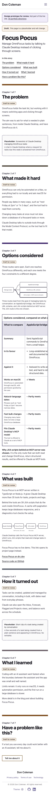 | 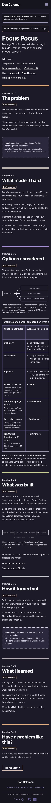 | 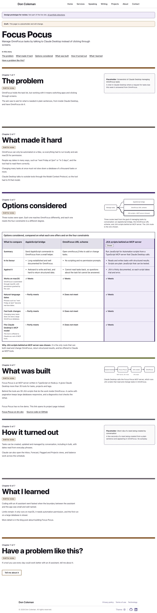 | 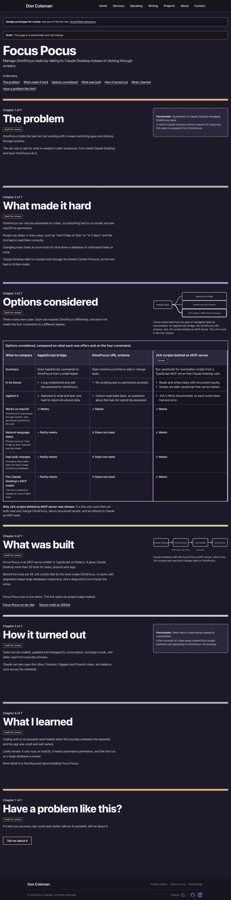 |
| Index | 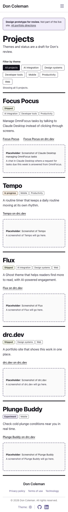 | 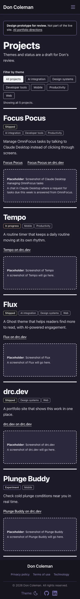 | 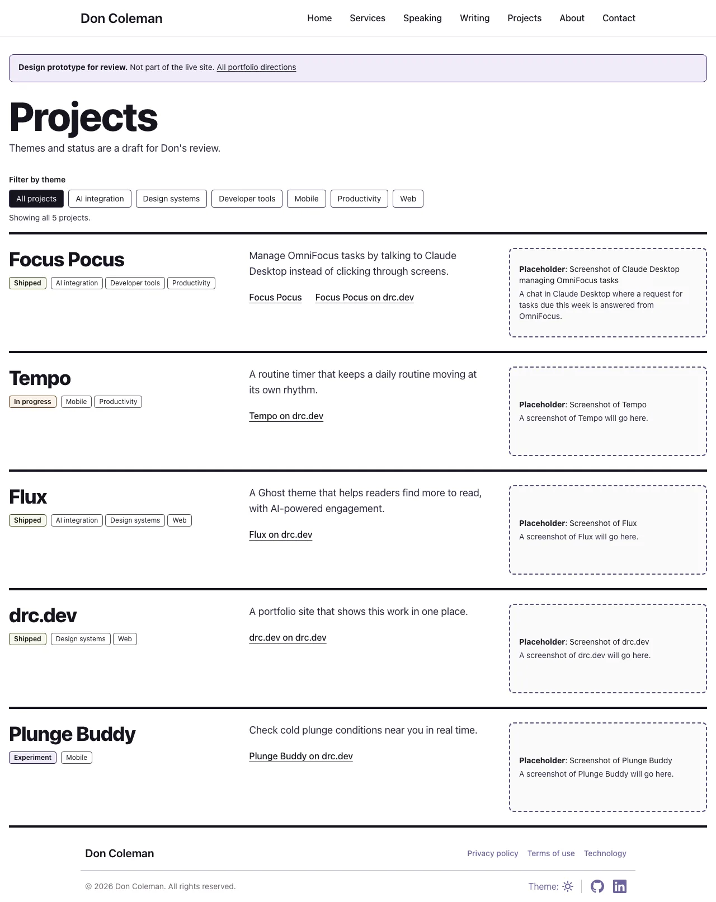 | 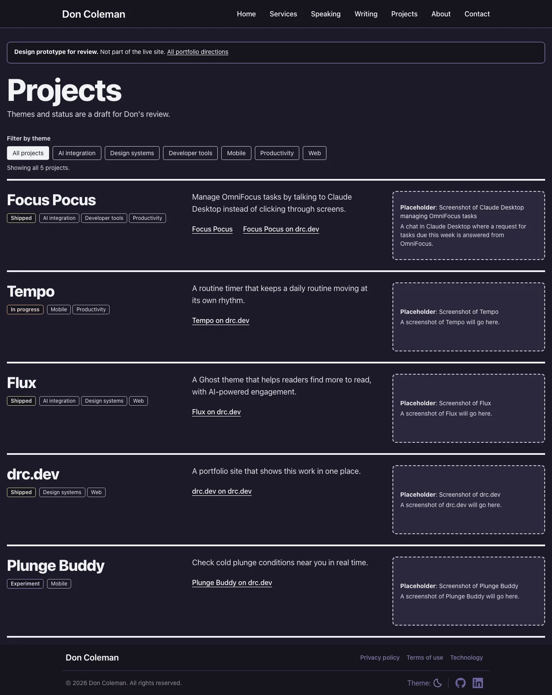 |

### How it works

**Story stages.** Seven full-width chapters in the fixed order. A progress bar fills across the top as you scroll, and the index lists the chapters as contents. With reduced motion requested the progress bar and the sticky panel are off and each chapter is a plain block. With JavaScript off the chapters read in order, because the story needs no script.

**Option comparison.** A comparison table of constraints against options, inside a scroll region so it can scroll sideways on a phone. The chosen option is marked and its reason stated. Reduced motion does not change the table. With JavaScript off it is the same static table.

**Demo embeds.** Linked, not embedded. A sticky visual panel sits beside the chapter text on wide screens and holds a labelled placeholder for a screenshot or clip, with links to the Focus Pocus page on drc.dev, which stands in for a live demo. With reduced motion requested, or on a narrow screen, the panel is an ordinary block after the text. Nothing autoplays, and the links work with JavaScript off.

**Scroll reveals.** Chapter headings uncover as they enter the viewport and the progress bar follows the page scroll, both through CSS scroll-driven animation where supported. Page changes use a cross-document view transition. With reduced motion requested the reveal, the progress bar and the transition are all off. With JavaScript off they still work, because they are CSS only.

### Trade-offs

**Does well.** The table is the clearest way to see options against constraints in one view. The sticky visual keeps the picture next to the words it illustrates on wide screens. The progress bar and the contents index help a reader see where they are in a long story.

**Does poorly.** The table is wide, so on a phone it scrolls sideways inside its region, which is harder to read than the other two directions' option views. The sticky panel only applies on wide screens with motion allowed, so phone and reduced-motion readers get a plainer page. It has the most layout rules of the three.

**Build and maintenance effort.** Medium to high. There is no custom script on the story page, but the sticky panel, the progress bar, the table region and the view transition each need checking across widths, themes and forced colours.

**Risks.** Accessibility: medium; the scroll region needs to be keyboard reachable and labelled, and the sticky panel must never cover focused content. Browser support: without scroll-driven animations the progress bar does not appear and headings show without the uncover; without view transitions pages load normally. Real media: the sticky panel gives large media the most room, but a tall clip beside long text needs tuning. Scaling: the table grows wider with more constraints and longer with more options.

### New visual resources

None.

## Comparison

This table describes the three directions side by side. It does not put them in an order.

| | Direction A: Timeline | Direction B: Cards | Direction C: Chapters |
| --- | --- | --- | --- |
| Fit with the site's current look | A single plain column using the existing tokens | Cards and a grid using the existing tokens | Full-width sections using the existing tokens, with a fixed progress bar added |
| How clearly the options are shown | Names first; each opens in place, so comparing means opening several | One tab per option, all names visible, one shown at a time | All options and constraints in one table |
| Reading on a phone | One column, no horizontal scroll | Cards stack to one column; tabs wrap | Chapters stack; the table scrolls sideways in its own region |
| Accessibility risk | Low: native elements | Medium: custom tabs need correct roles and focus | Medium: scroll region and sticky panel need care |
| JavaScript shipped | The index filter only | The index filter and the option tabs | The index filter only |
| Behaviour without scroll-driven animations or view transitions | Stages show without the fade | Cards show without the rise; pages change without a transition | No progress bar or heading uncover; pages change without a transition |
| Demo embedded or linked | Linked | Linked | Linked |
| Effort to build and maintain for real | Low | Medium | Medium to high |

## Contact hand-off

Each story ends with a hand-off to the contact form that carries the project with it: `/contact/?project=focus-pocus`. How the contact page should read that value is described in `specs/006-portfolio-design-directions/contracts/contact-handoff.md`. The prototypes only build the link; the contact page is not changed.

## Decision

Story pages: Direction C
Index page: Direction C, but using the content layout of Direction A (two column instead of three)
