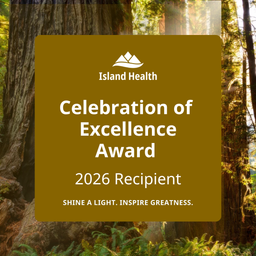
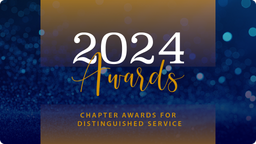
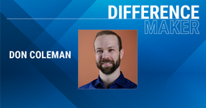

I'm a healthcare technology leader on Vancouver Island. My day job is data infrastructure and architecture at Island Health. The rest of the time I'm trying to make sense of how systems, people, and technology fit together, and writing down what I learn.

## About me

- **Current role:** Director, Data Infrastructure and Architecture @ Island Health — leading data warehousing, data modernization, and AI support and compliance for a regional health authority.
- **Education:** Currently pursuing an MBA at Royal Roads University, specializing in International Business and Innovation Management and researching the experienced value of the Certified Health Executive (CHE) designation.
- **Leadership:** Directed multi-disciplinary teams, developed strategies, and managed critical projects including pandemic response planning and digital transformation.
- **Volunteer work:** Treasurer and Director at Large for the Canadian College of Health Leaders — Vancouver Island Chapter, supporting mentorship and professional growth in the community.
- **Values:** Curiosity, growth, courage, respect, and compassion guide everything I do. I want to understand complex systems, challenge assumptions, and find insights worth sharing in technology, healthcare, and leadership.

### Recognition

<SideImage>

2026 Celebration of Excellence award recipient for the "Leading our C.A.R.E. Values" category.

</SideImage>

<SideImage>

[2024 CCHL Chapter Award for Distinguished Service](https://cchl-ccls.ca/news_article/2024-chapter-awards-for-distinguished-service/)

</SideImage>

<SideImage>

2024 CCHL Member Profile — [Don Coleman expresses the importance of exercising curiosity for healthcare leaders](https://cchl-ccls.ca/news_article/don-coleman-expresses-the-importance-of-exercising-curiosity-for-healthcare-leaders/)

</SideImage>

## About the writing

The [writing](/writing/) here is called **Drift & Convergence**, and it runs in two series. [Convergence](/writing/convergence/) is about systems leadership: creating alignment and leading change when the path isn't clear. [Drift](/writing/drift/) is where curiosity leads, with emerging technology, AI and hands-on experiments, including the parts that didn't work.

If any of this overlaps with what you're working on, I'd like to hear about it. The [contact page](/contact/) is the best way to reach me.
