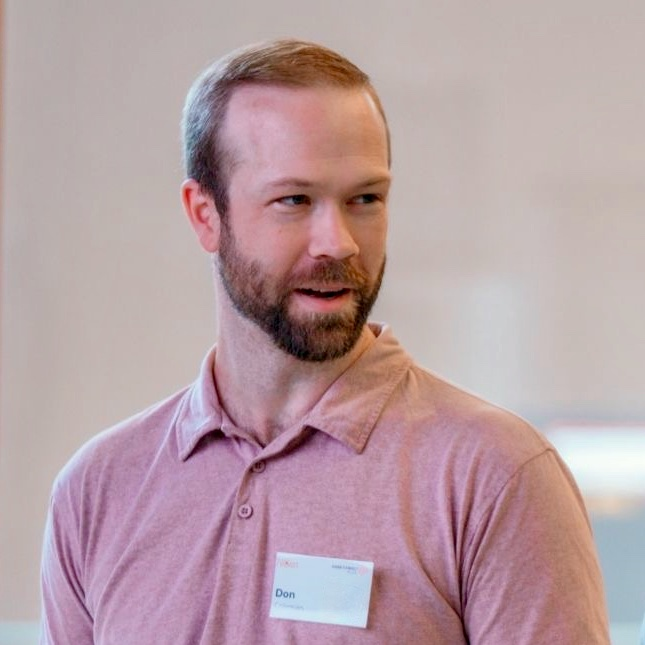

A note before you read on: I don't have a consulting practice today. The kinds of work below are ones I'm considering offering, written down so I can hear whether they would be useful. If one of them would help you, I'd like to know.

<Lead>
Most technology change in healthcare doesn't come apart on the technology. It comes apart in the gaps: between the team that chose a tool and the team that has to live with it, between a plan on paper and the people it depends on. I've spent my career in those gaps. This page covers the work I'm considering taking on outside my day job and the talks I give, which come from the same work as my writing.
</Lead>

<Offerings title="Kinds of work">
  <Offering title="Advice on technology change">

  You have a decision in front of you: a new platform, an AI pilot, an integration nobody wants to own. I help you name the real problem, lay out the options with their trade-offs, and leave with a plan your team can act on. Most of my experience is in healthcare and the public sector, where the stakes and the constraints are both high.

  </Offering>
  <Offering title="Workshops">

  Working sessions on systems thinking and leading change when nobody reports to you. They draw on the approaches I write about in the Convergence series and on what has, and hasn't, worked for me in practice. Expect more conversation than slides.

  </Offering>
  <Offering title="Plan reviews">

  A second look at a technology plan before money is committed. I read what you have, ask the questions a vendor won't, and write up what I would change and why. It's a small investment next to the cost of finding the gaps later.

  </Offering>
</Offerings>

<TextBlock title="How I work">

I start by listening and learning how your team works today, because the plan that fits on a slide rarely survives contact with the real workflow. We agree the goal and the time frame in writing. I share what I find as I go rather than saving it for a final report, and I hand over notes your team can keep using after I'm gone.

Anything I take on would sit alongside a full-time role, so it would be a small number of engagements at a time, and I'd be upfront about what I can fit in.

</TextBlock>

<TextBlock title="What I do not do">

- I will not operate production systems for clients, but I can help you build them or build the capability in your teams.
- I will not take work that creates any perceived or actual conflicts with my full-time role.
- I do not promise results I cannot measure.

</TextBlock>

<Offerings title="Talk topics">
  <Offering title="Systems thinking for technology leaders">

  Why well-run projects still fail to change anything, and what it takes to see an organization as a whole rather than a collection of parts. Practical habits for leaders who have to make decisions inside systems they don't fully control.

  </Offering>
  <Offering title="Practical AI in healthcare">

  What I've learned from building AI integrations and watching them meet reality. Where the value is showing up, where the friction and the risks are, and how to experiment responsibly when the data is patient data.

  </Offering>
  <Offering title="Leading change without formal authority">

  Most of the change that matters is led by people who can't tell anyone what to do. The mindset shifts and conversations that worked for me in healthcare transformation, and the approaches that didn't.

  </Offering>
</Offerings>

<TextBlock title="Past talks">

I'm pulling together a list of past talks, with the event, the year, and a link to the recording where one exists. Until it's here, my writing is the best sense of how I think and present.

</TextBlock>

<TextBlock title="For event organizers">

Here is a short bio you can paste into a program, with a photo below. If you need a different length or a newer headshot, ask through the contact page.

Don Coleman is Director, Data Infrastructure and Architecture at Island Health, where he leads data warehousing, data modernization, and AI support and compliance. He writes about systems leadership and practical AI at [Drift & Convergence](/writing), is pursuing an MBA at Royal Roads University, and serves as Treasurer and Director at Large of the Canadian College of Health Leaders' Vancouver Island chapter.

</TextBlock>

<Figure caption="Don Coleman, for event programs">

</Figure>

<CallToAction label="Get in touch" href="/contact/">

Describe a project you're working on, or tell me about your event, its audience and the date, and we can work out the rest.

</CallToAction>
