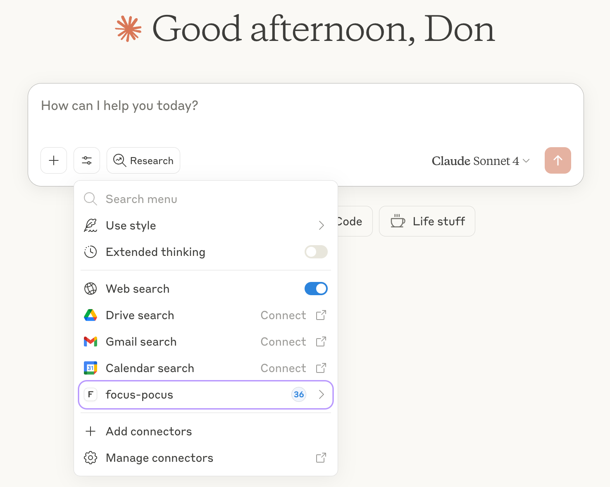
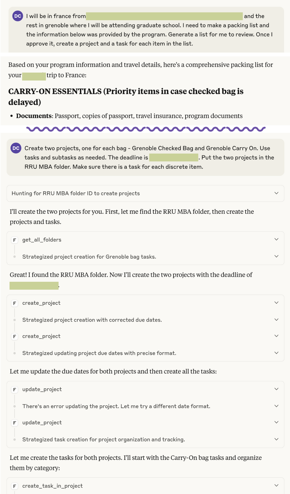

I use Generative AI for a lot in day-to-day life now, but one of my favourites is using it to generate the tasks for a project that I want to achieve. Whether that's a complex assignment I need to plan for my MBA, a side project I want to explore, or building a new habit, I use Generative AI to break it down into actionable steps and give myself deadlines.

To incorporate that into my task management system, OmniFocus 4, I convert it to TaskPaper and import it. The conversion doesn't always go well and I often spend extra time trying to convince the AI to format things just right so that it imports cleanly. Different tools and models have drastically different results too.

I have been wanting to experiment with Claude Code and get a better understanding of agentic AI coding. Building an MCP (Model Context Protocol) server to integrate generative AI with OmniFocus was a natural way to experiment with the concepts that I wanted to learn about. It solves a problem I have and it's low stakes enough that I can afford to fail and learn. Mission accomplished—I learned a ton and it works surprisingly well.

Before I go any further, here is the project! The name is just a fun way to capture OmniFocus and the magic of AI. Open source and free to use/improve:

[GitHub - drcdev/focus-pocus: A local MCP server for OmniFocus 4](https://github.com/drcdev/focus-pocus) A local MCP server for OmniFocus 4. Contribute to drcdev/focus-pocus development by creating an account on GitHub.

## Beyond Personal Productivity

This friction between AI insights and actual workflow/systems isn't just my problem, it's everywhere. Working in healthcare technology especially, we have potential to generate amazing efficiencies with AI, but getting them into operational systems remains clunky, manual, and loaded with risks. Our systems and data models were never designed with AI in mind and reliability/safety expectations are far higher than what most AI tools deliver. Personally, I have a hard time trusting that AI will do what I ask it to do. This project was full of interesting mishaps that reinforced the need for a human in the loop, in addition to careful prompting and some guardrails.

## Understanding the Technical Reality

Before diving into building, I needed to understand what I was working with:

- **MCP as integration approach**: MCP is like giving AI a set of tools it can discover and use on its own without complex programming. Whereas traditional API integrations require you to specify exactly how to communicate with each system.
- **Claude.ai**: I chose Claude Desktop for the AI interface due to its MCP support and sticking to one subscription.
  - I started on Claude Pro for access to Claude Code, but upgraded to Claude Max 5x for access to Opus and higher usage limits.
  - Perhaps the biggest surprise of this project was breaking through my longstanding refusal to pay more than $30/month for AI. I've only paid for a month of Max, but if I keep seeing value, I may keep it longer term.
- **OmniFocus Automation**: There are a few ways that OmniFocus can talk to other apps. JXA, or Javascript for Automation, is a way to control Mac apps using Javascript code and OmniFocus has it built in. I plan to revisit this in the future, because there are other options including Applescript, url schemes, email capture, calendar integration, and Actions. For now, JXA seemed the most complete and convenient option.
- **Performance was going to be a problem**: JXA is not a high-performance API, so I needed to build caching and pagination into the integration.
- **API changes**: OmniFocus 3 > 4 changed some established API patterns and confused Claude Code more than once.
- **Environment**: OmniFocus is primarily a macOS app, so I needed to run this locally.

## What I Learned Along the Way

I started with a vision and a detailed workplan, but focused on getting basic operations working reliably first. Any AI tool can create a plan like this, but I used Claude to create the plan and initialize the repo. Working with Claude Code and the OmniFocus API taught me some things about AI-assisted development that I think apply way beyond this project:

**Managing context is a full-time job**

- Even when I explicitly told it to follow the API docs, Claude would make assumptions and get things wrong. A knowledgeable human in the loop is essential to catch these mistakes.
- My costs were predictable using a subscription (rather than an API key), but I still had to work in five-hour blocks. It took time to learn how to keep the right context active and when/what to do before clearing it. It is easy to burn through your 5 hour allocation if you don't manage context, and then I would have to wait for the block to reset to continue. Managing instructions in Claude.md and providing detailed prompts or maintaining task lists was a very important skill to learn.

**Most systems aren't really "modern"**

- JXA isn't a REST API and I wouldn't call it modern (stagnant development, limited documentation, etc.). It's Mac specific and specialized.
- Most business systems weren't built with AI in mind—they use older, specialized ways of communicating that are like speaking different dialects. MCP helps translate between these systems and AI. I am curious how it could work alongside healthcare data standards (ex. HL7 FHIR) to support interaction with patient information.

**Performance matters**

- The JXA script-based automation is slow and some actions require very high timeouts, even with only 1600 tasks in my OmniFocus database.
- I haven't had the time to dig into what optimizations might be possible, but I will do a code review to ensure the tools are all using best practices from the OmniFocus documentation.
- Many of the JXA scripts only worked when saved as files rather than run directly in memory, creating a cold start problem—like a car engine that needs warming up, they take time to get ready before they are useful. To fix this, I added caching (saving frequently-used data to avoid re-fetching it) and pagination (processing my 1600 tasks in smaller chunks rather than all at once).

**You have to plan for failure**:

- This is obvious to any experienced developer. I found that Claude Code loves to throw try/catch blocks in, but doesn't necessarily think through the different modes of failure.
- Claude initially assumed the system would respond like a modern web service (instant, reliable responses). In practice, requests took longer than expected and we had to learn to plan around it.

## Actually Building the Thing

### How MCP Works

MCP is pretty elegant. You define tools that the AI can discover and use. It abstracts away the complexity of direct API calls, allowing you to focus on defining what the AI can do with your system.

```typescript
const tools = [
  {
    name: "get_all_tasks",
    description: "Retrieve tasks with pagination",
  },
  {
    name: "create_task",
    description: "Create a new task with natural language dates",
  },
  // ... 35+ tools total
];
```

Each tool is focused on a specific task and provides a natural way for AI to find the right information at the right time. I'm still early in exploring MCP as a protocol and what other alternatives exist, but it definitely has me thinking.

<Figure caption="Focus Pocus as an available set of tools in Claude Desktop">



</Figure>

### Working with What You've Got

JXA was my only option for OmniFocus integration, so I had to make it work. I started with basic task operations and built up from there. The initial focus was on getting the core functionality working reliably before adding advanced features.

There are other integration methods, but none of them worked quite the way I wanted. I needed to interact with OmniFocus in the background. Opening the app to accomplish the task would defeat the purpose (ex. url schemes would open the app, Actions would open a MacOS overlay, etc.).

I knew the magic would still sit in the generative AI side, so what I was really setting out to accomplish is a reliable and safe integration with Omnifocus data.

### When the Vibes Meet Reality

Once I got the basic integration working and a coding pattern established, everything else came together surprisingly fast. I used Claude to generate the initial structure and JXA scripts, then iteratively refined them based on how they performed in practice. The AI was surprisingly good at generating the boilerplate code, but I had to do a lot of the heavy lifting to make it reliable.

Meanwhile, as soon as the complexity increased, I started running into issues with Claude's behavior. Even when I explicitly told it to follow the API documentation, Claude would make unexpected assumptions and break things. I had to correct it multiple times for the same issues or explicitly tell it to follow the guidelines that it is supposed to follow automatically.

I ended up implementing a `safeGet` pattern across all the integration scripts—if the normal way to get information doesn't work, try another way, and if that fails too, use a reasonable guess instead of crashing. Claude planned to remove it multiple times and I would have to point it back to the documentation.

You get speed from AI handling the boilerplate, but you still need human oversight to make sure it's headed in the right direction. I see this everywhere in AI-assisted development forums and communities. The AI is a powerful tool, and can generate incredible progress, but it doesn't replace the need for skilled developers/architects (maybe it will, but I hope it won't). Sub-agents and other tools can help, but it's an evolving skill and will continue to change rapidly.

### Testing It in the Real World

I started simple. I began with basic task creation and worked up to complex project management, all through actual Claude Desktop conversations. I used a phased list of prompts to quickly identify when something was broken and used that to iteratively improve the integration.

The big test was generating a packing list for my trip to France and creating all the projects, tasks, and subtasks in OmniFocus. Multiple projects, natural language dates, the works. It actually worked really well with minimal cleanup.

<Figure caption="Claude Desktop using the Focus Pocus MCP tool">



</Figure>

With one minor hiccup on dates, it was otherwise mission accomplished! I trust my MCP server for use now, but remain cautious that an AI using this tool could definitely do something unexpected. If you choose to use it, be careful and make sure you have OmniFocus backups enabled!

## Closing Reflections

This project got me thinking about AI systems that understand workflow patterns and can orchestrate work, not just answer questions or chat. The world of agentic AI is evolving rapidly, and I want to explore how these concepts can be applied to real-world systems, especially in healthcare where I work. The expectations for reliability and safety are extremely high and it warrants deep exploration and commitment from everyone involved.

Building this integration pushed my AI skills forward and gave me a much deeper understanding of agentic coding and MCP. For anyone working in technology, especially in healthcare, these could be critical skills to develop. AI literacy will be a core competency. I don't quite buy the hype that everything has changed, but it is evolving rapidly. At the very least, traditional leadership styles will need to adapt and systems leadership capabilities will be more important than ever.
