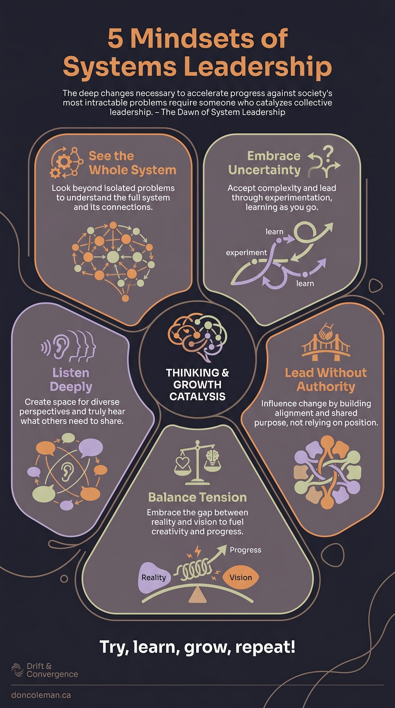
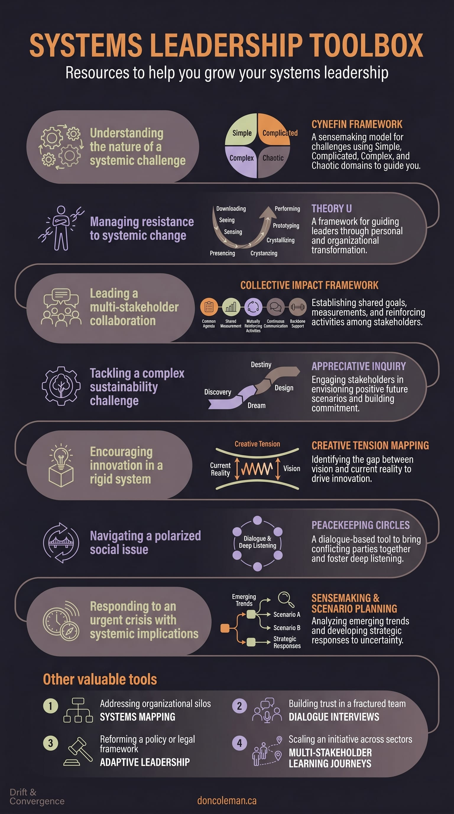

How do you lead when you can't control the outcome? When the challenge spans multiple departments or organizations, none of which report to you? When the technology changes faster than your organization can adapt?

These aren't hypothetical questions. They're the reality many people face leading transformation in healthcare and technology. Traditional leadership approaches often break down in these environments. It's difficult to direct people to adopt new tools, control how quickly teams learn, or predict how AI, security, and compliance requirements will evolve.

Systems leadership creates conditions where diverse groups generate solutions together on problems too complex for any one team to handle. Teams build on each other's insights, discover connections between tools and workflows that no single person could have designed, and transform the gap between current capabilities and future possibilities into fuel for innovation rather than frustration. Unlike traditional leadership that directs and controls, systems leadership enables this collective wisdom to emerge.

This capability isn't reserved for executives or formal leaders. Students organizing campus sustainability initiatives, volunteers coordinating community response to local challenges, and individual contributors bridging silos across their teams may all practice systems leadership.

The mindset shifts that follow can apply whether you're leading a global transformation or improving collaboration in your local project team. This framework—[the first in an eight-part series exploring systems leadership tools](/writing/starting-something-new/)—emerged from my commitment to making these concepts accessible and actionable.

So, why do so many transformation efforts struggle despite strong leadership and clear vision?

## When Traditional Leadership Meets Complex Reality

Traditional hierarchical leadership can break down when facing complex, adaptive challenges. The gap becomes visible when well-intentioned leaders apply command-and-control approaches to situations requiring collaboration and organic solutions.

These are exactly the kinds of challenges that prompted my opening questions. You can't control how teams adapt to new technology, mandate genuine collaboration through org charts, or predict how regulatory requirements will shift. The traditional tools simply don't match the nature of the challenge.

### My First Encounter with Systems Complexity

I discovered these limitations firsthand early in my career at Island Health. As testing coordinator, I was responsible for developing training on testing methodology and coordinating major electronic health record changes. It was work that required uniting teams across IT, clinical, and informatics groups. I did what I was asked to do: created comprehensive training frameworks, delivered them diligently, and developed detailed coordination plans. But it wasn't working. The training didn't stick beyond the current change, and I found myself explaining the same concepts repeatedly. My lack of formal authority felt like a constant barrier. This was my first real encounter with the gap between traditional approaches and systems reality. I didn't have the language for it yet. What eventually worked wasn't better training or more detailed plans, but learning to facilitate conversations where teams could discover solutions together.

This wasn't just my personal learning curve. It reflects a broader reality about how organizations actually change.

### Understanding Continuous Adaptation

Healthcare systems constantly demonstrate continuous adaptation. Canadian healthcare illustrates this: regionalization in the 1990s built foundations for integrated care, electronic health records in the 2000s created information infrastructure, digital health strategies in the 2010s enabled service coordination, and AI and virtual care in the 2020s now aim to improve access and person-centered care.

Each decade also brought crises that demanded adaptive responses: SARS tested emergency preparedness, H1N1 challenged vaccine distribution, the opioid crisis exposed mental health gaps, and COVID-19 accelerated virtual care adoption while revealing system fragility and resilience.

Working across healthcare transformations and crises, I've learned that what feels like chaos is actually the natural state of complex systems adapting to multiple pressures. Each transformation creates new capabilities while revealing new challenges. Systems leaders recognize this as natural rather than a problem to solve. The opportunity lies in building adaptive capacity rather than seeking deterministic solutions.

The mindset shifts that follow have helped me navigate these gaps between traditional approaches and systems reality. They're not prescriptions but practical adaptations I've found useful when control isn't possible.

## Five Systems Leadership Mindset Shifts

To move from solving problems individually to building capacity together, leaders need to shift how they think and act. These five mindset shifts provide a practical framework for developing systems leadership capability.

### Mindset Shift #1: See the Whole System

**From**: Fixing individual problems in isolation  
**To**: Understanding interconnections and root causes

Traditional leaders focus on discrete problems and direct solutions. Systems leaders recognize that problems exist within webs of relationships and sustainable solutions must address root causes and systemic patterns.

During the COVID-19 pandemic, I worked with a healthcare executive to map technology modernization opportunities alongside mission-critical community work. Rather than focusing on individual system upgrades, we saw connections between virtual care trials, patient registration innovations, and new staffing models. This systems view emerged through conversations with frontline staff, site visits, and bringing different areas together.

The same systems thinking principles apply across any complex domain. In my cloud migrations, mapping the whole system revealed technical migration was only a small piece of complex interconnections. Beyond infrastructure and data, we uncovered how software lifecycles influenced adoption timelines, training schedules affected readiness, and compliance shaped deployment. Root causes of adoption challenges, such as workflow disruptions, change fatigue, and competing priorities, were connected across departments. Rather than treating each dependency as isolated, we addressed the systemic patterns linking them.

**Practical Application**: Before proposing solutions, create a simple systems map showing stakeholder relationships, information flows, and decision points. Ask: "Who else is affected by this challenge? What connections are we missing?"

Once you see the whole system, you'll often need to navigate its inherent uncertainties.

### Mindset Shift #2: Embrace Uncertainty

**From**: Controlling outcomes through detailed planning  
**To**: Experimenting and adapting through iterative learning

Traditional leaders create comprehensive plans to minimize uncertainty. Systems leaders create safe experiments to learn what works when they can't predict outcomes.

The pandemic was a masterclass in embracing uncertainty. Direction changed daily or hourly, making comprehensive planning impossible. Instead, we tracked key themes and built around certainties: we knew we'd need patient contact systems for scheduling and reminders, but couldn't nail down clinical workflows. So we built high-quality core features and integration capabilities. When details became clearer, creating full applications was easier. When needs changed again, we adapted and reused previous work.

**Practical Application**: For your next progress-resistant initiative, design "safe-to-fail" experiments that generate learning while minimizing risk. Replace 12-month plans with 90-day or even 30-day learning cycles. Ask: "What assumptions can we test quickly and cheaply?"

When you can't predict outcomes, embracing uncertainty naturally leads to listening more deeply to understand what is actually happening.

### Mindset Shift #3: Listen Deeply

**From**: Persuading others to accept your solution  
**To**: Creating space for diverse perspectives and genuine understanding

Traditional leaders focus on presenting compelling arguments for predetermined solutions. Systems leaders create conditions where collective wisdom can emerge through genuine dialogue and shared understanding.

Our Microsoft 365 migration wasn't moving as quickly as expected, and it wasn't clear what the issues were. I joined the project on an interim basis to help turn things around. I knew the team had already tried forging forward and that technical skill wasn't the issue. So I spent significant time talking to each team member, talking to clients, understanding their concerns and current challenges, and looking for root causes together. It took time to surface solutions, but we found some, and the migration rate quadrupled over two months.

This principle applies regardless of formal role or setting. A student addressing campus food insecurity could conduct informal conversations with classmates in dining halls, observe students at the campus food pantry, and ask student workers about what they notice. These conversations might reveal that stigma and accessibility concerns outweigh availability in determining who seeks help.

**Practical Application**: Replace presentation meetings with listening sessions. Before your next major decision, ask stakeholders: "What's your experience of this challenge?" Listen for patterns, concerns, and assets that weren't part of your initial analysis.

Deep listening can enable collaboration even without formal authority.

### Mindset Shift #4: Lead Without Authority

**From**: Using position power to drive compliance  
**To**: Building alignment and shared purpose across organizational boundaries

Traditional leaders rely on hierarchical authority to implement decisions. Systems leaders work across boundaries where formal authority doesn't exist, building alignment through shared purpose and collaborative problem-solving. This mindset shift is powerful for those without formal titles—students, volunteers, and individual contributors often excel at systems leadership because they must build alignment through influence rather than position.

Healthcare CEOs demonstrate this through CHLNet, a coalition of 40+ organizations with the vision "Better Leadership, Better Health—Together." CEOs contribute without formal authority over other members, building alignment through shared priorities and collaborative initiatives. They create collective value no single organization could achieve alone, using trust and reciprocity rather than hierarchical control.

Of course, you don't need to be a CEO to lead without authority. A project coordinator with no direct reports could build alignment between IT, clinical, and facilities management teams by facilitating shared planning sessions and creating transparent progress dashboards that help everyone see how their work connects.

**Practical Application**: Replace directive language ("You need to...") with collaborative language ("How might we...?"). Instead of presentations explaining what others should do, facilitate conversations about what the group can accomplish together.

When you lead without formal power, you must work with the natural tensions and resistance you encounter, rather than trying to eliminate them.

### Mindset Shift #5: Balance Creative Tension

**From**: Eliminating problems and resistance  
**To**: Using the gap between current reality and future vision as fuel for change

Traditional leaders view problems and resistance as obstacles to overcome. Systems leaders learn to recognize that tension between current reality and desired future contains essential information about what needs to change and the energy needed for transformation.

Balancing creative tension has been essential in my approach to bridging the gap between like-for-like migration and full adoption of modern tools. We didn't have resources to do everything at once, but helping people understand a future vision of what was possible helped bridge the gap and encourage incremental changes with available resources. Rather than eliminating the tension between current constraints and future possibilities, I learned to use it to identify opportunities where small investments in modern capabilities could deliver immediate value while building toward our longer-term vision.

This approach can reveal insights in many different contexts. When coordinating volunteers for a major community fundraising event, initial resistance to new coordination approaches might reveal deeper concerns: experienced volunteers feeling their expertise isn't valued, newer volunteers feeling overwhelmed by complex processes, and competing priorities between different volunteer groups. Rather than pushing through with predetermined plans, this tension could drive creation of mentorship pairings between experienced and new volunteers, simplified task structures that build confidence, and recognition systems that honour different contributions.

**Practical Application**: When facing resistance or persistent problems, ask: "What is this tension telling us about what needs to change?" Use resistance as diagnostic information rather than trying to eliminate it.

Putting these mindsets into practice takes more than good intentions. It requires conscious choice and regular reflection.

## The Systems Leadership Wayfinder

Throughout my various roles at Island Health, from enterprise systems development manager facilitating between health record teams and integration partners, to pandemic planning where I helped operationalize or wind-down rapidly deployed technologies, these mindsets have been essential. Each role required extensive collaboration across the health authority and beyond, regardless of formal authority. I've experimented with these approaches in different contexts, watching what works and what doesn't, learning from colleagues who navigate complexity with remarkable skill.

I created the Systems Leadership Wayfinder to consolidate these practical mindsets into something tangible. I keep it printed at my desk as a quick reference when I'm facing a challenge or feeling frustrated and stuck. It's a reminder that there's usually another way to approach the problem. One that works with the system's complexity rather than against it.

The downloadable Systems Leadership Wayfinder includes the five mindsets and provides tool descriptions, scenario applications, and self-assessment frameworks for continued development. [Parts 2-7 in this series](/writing/starting-something-new/) will dive deeper into these tools. I hope it can help you frame and explore problems, inspire collective action, and navigate complexity.

<Figure>

</Figure>

<Figure>

</Figure>

The Wayfinder represents what I've learned so far, with tools to practice when the situation calls for it. Systems leadership is itself an evolving practice.

## Common Pitfalls

Even with the best intentions, these mindset shifts can lead you astray when not fully integrated. Watch for these patterns as you try, learn, and grow:

- **Seeing Systems, Acting in Silos**: Mapping connections but solving problems departmentally. Your systems view should guide your solutions.
- **Experimenting Without Learning**: Running tests but not capturing insights. Build review loops into every experiment.
- **Listening Without Acting**: Gathering stakeholder input but not changing your approach. Make explicit connections between what you heard and what you'll do differently.
- **Collaborating on the Surface**: Using "how might we" language while still pushing predetermined solutions. Enter conversations genuinely open to different outcomes.
- **Diagnosing Tension Without Channelling It**: Understanding what resistance reveals but not creating outlets for that energy. Convert tension into constructive change, don't ask people to accept it.

## Conclusion: Leading for Complex Change

Systems leadership isn't about having all the answers. It's about creating conditions where collective wisdom can emerge. The five mindset shifts provide a foundation for this work: seeing whole systems, embracing uncertainty, listening deeply, leading without authority, and balancing creative tension.

Today's complex challenges require us to lead differently. I'm continuing to explore how these approaches apply across different contexts and would welcome your experiences. Start with one mindset shift, one conversation, one experiment.

## Printable Resources

[System Leadership Wayfinder - Color (PDF)](/files/systems-leadership-infographic-colour.pdf)

[System Leadership Wayfinder - Gray (PDF)](/files/systems-leadership-infographic-gray.pdf)

## Practical First Steps: Where to Start Your Systems Leadership Journey

If you're ready to experiment with these approaches, here are some ways to begin. These approaches can work regardless of your role, title, or career stage. The key is starting with one mindset shift and one meaningful relationship or challenge.

### Immediate Actions (This Week)

**If you're working in technology**:

I've found it helpful to start by mapping one current challenge showing all interested groups and their interconnections. In cross-functional meetings, try shifting from "How do we convince them?" to "What's their experience of this challenge?" Partnering with teams already eager to experiment tends to work better than forcing change.

**If you're working in healthcare**:

Consider scheduling informal conversations with frontline staff, patients, and vendors about the same challenge. Watch for recurring issues across departments—they usually point to deeper system dynamics. With persistent problems, experiment with asking "What deeper need is this problem pointing to?"

### 6-Week Development Plan

Here's one approach to developing these mindsets over six weeks. Your situation is unique, so treat this as a starting point rather than a prescription. Adjust the timeline and activities based on what you're facing.

**Week 1: See the Whole System**  
Create systems maps for 2-3 current challenges. Identify stakeholder connections you hadn't considered. Schedule one conversation outside your usual network.

**Week 2: Embrace Uncertainty**  
Design one "safe-to-fail" experiment with clear learning objectives. Replace one long-term plan with a 30-day learning cycle. Document weekly learnings.

**Week 3: Listen Deeply**  
Conduct 3 listening sessions with different stakeholder groups about the same challenge. Focus on understanding their experience rather than validating assumptions. Look for patterns across conversations.

**Week 4: Lead Without Authority**  
Practice collaborative language—replace "you need to" with "how might we." Facilitate one cross-functional conversation where you have no formal authority. Document what alignment strategies work best.

**Week 5: Balance Creative Tension**  
Explore what one source of resistance reveals about needed changes. Instead of eliminating a persistent problem, use it as diagnostic information. Create solutions that work with the tension rather than against it.

**Week 6: Integration and Reflection**  
Assess which mindset shifts feel natural and which need attention. Create an action plan combining insights from weeks 1-5. Choose one mindset for continued focus and identify colleagues to practice with going forward.
